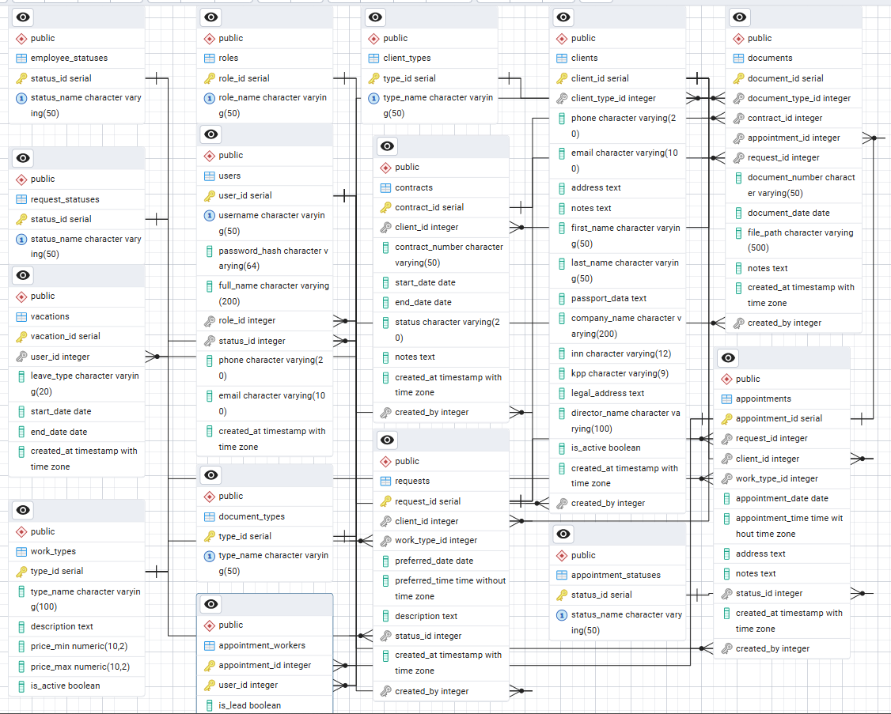

# WpfPlannerApp

**Автоматизированная система управления заявками и выездами для компании-провайдера услуг связи.**

Система обеспечивает полный цикл обработки заявок клиентов — от регистрации обращения до выполнения выездных работ и формирования закрывающих документов.

1. Основные возможности

| Модуль | Описание |
|--------|----------|
| **Заявки** | Приём и обработка заявок от физических и юридических лиц |
| **Наряды** | Автоматическое формирование нарядов на основе заявок |
| **Бригады** | Назначение сотрудников с проверкой занятости |
| **Календарь** | Визуальное планирование выездов на месяц |
| **Журналы** | Просмотр и фильтрация заявок, нарядов, документов |
| **Отчёты** | Экспорт в Excel с аналитикой |
| **Документы** | Генерация договоров и актов в DOCX |
| **Роли** | Администратор, менеджер, работник |
| **Безопасность** | Хеширование паролей (SHA-256), параметризованные запросы |

2. Технологический стек

| Компонент | Технология |
|-----------|------------|
| Язык | C# (.NET 8) |
| UI | WPF (XAML) |
| СУБД | PostgreSQL 14+ |
| Доступ к БД | Npgsql |
| Отчёты | ClosedXML |
| Документы | DocumentFormat.OpenXml |
| IDE | Visual Studio 2022 |

3. Схема базы данных



Основные таблицы:
- users — сотрудники
- clients — клиенты (физлица / юрлица)
- requests — заявки
- appointments — наряды
- appointment_workers — бригады
- contracts — договоры
- documents — документы
- work_types — услуги
- vacations — отпуска/больничные

4. Установка и запуск

### Требования:
- Windows 10/11
- PostgreSQL 14+
- .NET Desktop Runtime 8.0

### Инструкция

```bash
# 1. Клонировать репозиторий
git clone https://github.com/Ваш_Ник/WpfPlannerApp.git

# 2. Создать базу данных в PostgreSQL
createdb -U postgres planner_db

# 3. Выполнить SQL-скрипт инициализации
psql -U postgres -d planner_db -f Database/init.sql

# 4. Изменить строку подключения в Services/Db.cs
# Host=localhost;Port=5432;Database=planner_db;Username=Ваш_юзернейм;Password=Ващ_пароль

# 5. Запустить приложение
dotnet run
